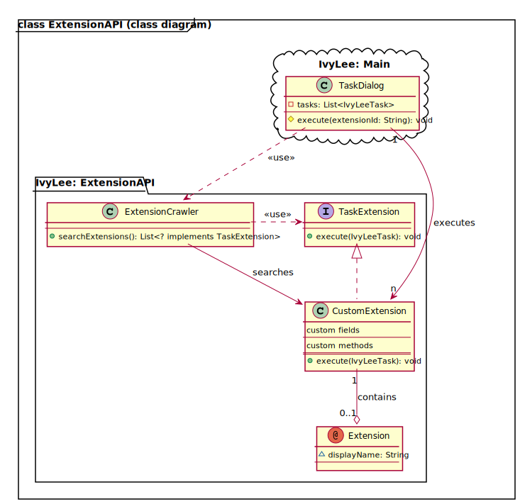

# IvyLee: Extension API

**Welcome to the IvyLee Extension API.**  

Want to write your own custom extension?  
Here you go!

### Writing your own extension

###### (under construction)

#### Project Setup

###### (under construction)

#### Class Hierarchy (UML class diagram)   

#### class Extension (annotation)

###### (under construction)

#### class TaskExtension (interface)

###### (under construction)

### Adding your Extension to the Application

###### (under construction)

