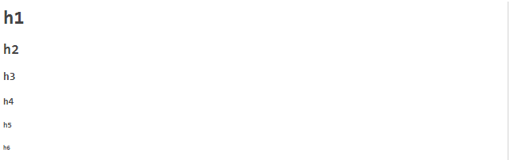
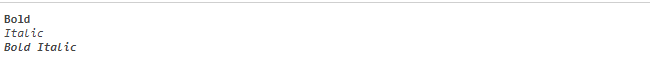
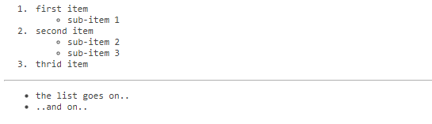
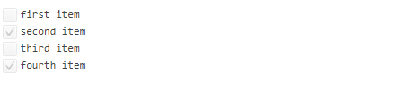
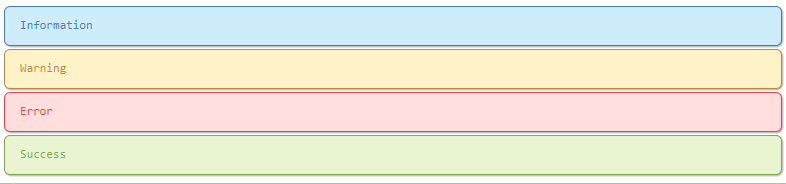

# Markdown SYntax Examples

## Headers

```markdown
# h1
## h2
### h3
#### h4
##### h5
###### h6
```
_Renders to:_  


## Bold / Italic

```markdown
**Bold**  
_Italic_  
_**Bold Italic**_  
```
_Renders to:_  


## Listings / Enumerations

```markdown
1. first item
	- sub-item 1
2. second item
	- sub-item 2
	- sub-item 3
3. thrid item
---
- the list goes on..
- ..and on..
```
_Renders to:_   


## Checkboxes / TODOs

```markdown
- [ ] first item  
- [x] second item  
- [ ] third item  
- [x] fourth item
```
_Renders to:_  


## Custom Styles
There are custom styles defined in [**style.css**](src/main/resources/de/ott/ivy/css/style.css).
  
```markdown
! This is an Information
!! Warning!
!v Success!
!x ERROR!
```
_Renders to:_  

