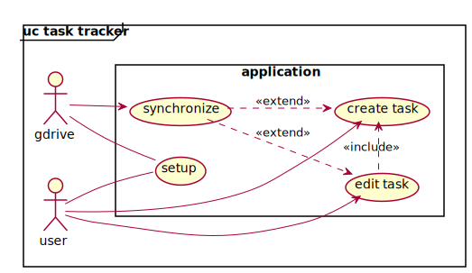

# Diagrams (Unified Modeling Language)
_**Get a better understanding of the application with these diagrams!**_

## Use-Case Diagram    
  
###### *(Generated from [src/main/kotlin/de/ott/ivy/Entrypoint.kt](../src/main/kotlin/de/ott/ivy/Entrypoint.kt))*  