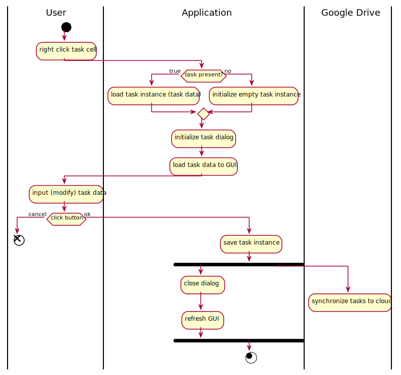
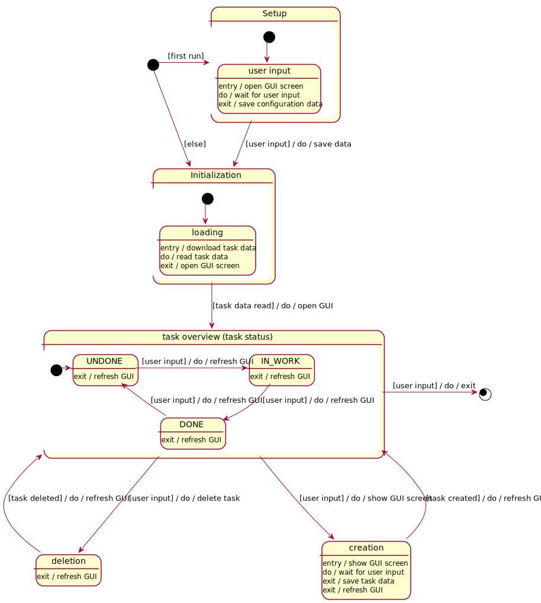

# Diagrams (Unified Modeling Language)
_**Get a better understanding of the application with these diagrams!**_

## Use-Case Diagram    
  
###### *(Generated from [de.ott.ivy.Entrypoint](../src/main/kotlin/de/ott/ivy/Entrypoint.kt))*

## Activity Diagram
  
###### *(Generated from [de.ott.ivy.Entrypoint](../src/main/kotlin/de/ott/ivy/Entrypoint.kt))*

## State Diagram
  
###### *(Generated from [de.ott.ivy.data.IvyLeeTask](/extension-api/src/main/kotlin/de/ott/ivy/data/IvyLeeTask.kt))*  